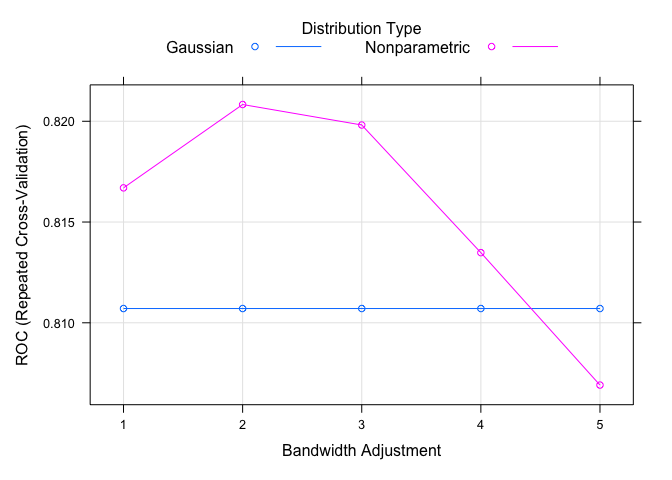
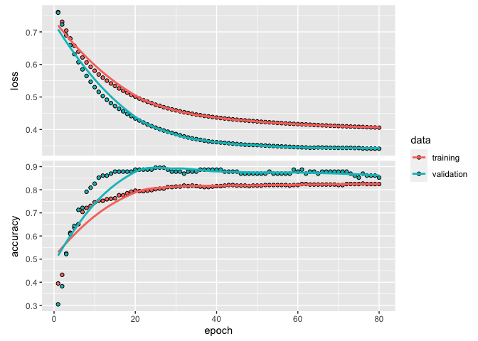

PM 616 HW1 due 9/14
================
Sylvia Shen
2022-09-07

# (a)

## Exploratory data analysis

The titanic data includes 1309 subjects (891 in training set and 418 in
testing set). There are in total 12 variables: the survival status
(`Survival`), passenger class (`pclass`), first and last name of the
passenger (`name`), sex, age, the number of siblings/spouses aboard
(`sibsp`), the number of parents/children aboard (`parch`), ticket
number (`ticket`), fare, cabin ID, and the port of embarkation
(`Embarked`).

``` r
# dim( titanic_train) ## 891 12
# head(titanic_train) 
# unique(titanic_train$Name) %>% length()

## table one 
cat_vars = c("Pclass", "Sex", "SibSp", "Parch", "Embarked")
tblone = CreateTableOne(vars = c("Age", "Fare", cat_vars), 
               factorVars = cat_vars, 
               data = titanic_train, 
               strata = "Survived", 
               includeNA = TRUE, test = FALSE, addOverall =TRUE)
print(tblone, missing = TRUE)
```

    ##                   Stratified by Survived
    ##                    Overall       0             1             Missing
    ##   n                  891           549           342                
    ##   Age (mean (SD))  29.70 (14.53) 30.63 (14.17) 28.34 (14.95) 19.9   
    ##   Fare (mean (SD)) 32.20 (49.69) 22.12 (31.39) 48.40 (66.60)  0.0   
    ##   Pclass (%)                                                  0.0   
    ##      1               216 (24.2)     80 (14.6)    136 (39.8)         
    ##      2               184 (20.7)     97 (17.7)     87 (25.4)         
    ##      3               491 (55.1)    372 (67.8)    119 (34.8)         
    ##   Sex = male (%)     577 (64.8)    468 (85.2)    109 (31.9)   0.0   
    ##   SibSp (%)                                                   0.0   
    ##      0               608 (68.2)    398 (72.5)    210 (61.4)         
    ##      1               209 (23.5)     97 (17.7)    112 (32.7)         
    ##      2                28 ( 3.1)     15 ( 2.7)     13 ( 3.8)         
    ##      3                16 ( 1.8)     12 ( 2.2)      4 ( 1.2)         
    ##      4                18 ( 2.0)     15 ( 2.7)      3 ( 0.9)         
    ##      5                 5 ( 0.6)      5 ( 0.9)      0 ( 0.0)         
    ##      8                 7 ( 0.8)      7 ( 1.3)      0 ( 0.0)         
    ##   Parch (%)                                                   0.0   
    ##      0               678 (76.1)    445 (81.1)    233 (68.1)         
    ##      1               118 (13.2)     53 ( 9.7)     65 (19.0)         
    ##      2                80 ( 9.0)     40 ( 7.3)     40 (11.7)         
    ##      3                 5 ( 0.6)      2 ( 0.4)      3 ( 0.9)         
    ##      4                 4 ( 0.4)      4 ( 0.7)      0 ( 0.0)         
    ##      5                 5 ( 0.6)      4 ( 0.7)      1 ( 0.3)         
    ##      6                 1 ( 0.1)      1 ( 0.2)      0 ( 0.0)         
    ##   Embarked (%)                                                0.0   
    ##                        2 ( 0.2)      0 ( 0.0)      2 ( 0.6)         
    ##      C               168 (18.9)     75 (13.7)     93 (27.2)         
    ##      Q                77 ( 8.6)     47 ( 8.6)     30 ( 8.8)         
    ##      S               644 (72.3)    427 (77.8)    217 (63.5)

From the table above, we first noticed that fare and passenger class are
quite different between the two groups; individuals who paid higher fare
and in the first class are more likely to survive. In addition, only
109(18.9%) of the males survived whereas 233(74.2%) of the females
managed to get out of the Titanic.

Passenger name and ticket number can be viewed as duplicated identifiers
such as passenger ID. Therefore, we drop passenger name and ticket
number, and keep passenger ID to be the unique identifier of each data
entry. There are in total 687(77.1%) individuals in the training data
that does not have available `Cabin` information. For other individuals
that have `Cabin` recorded, most `Cabin` numbers are unique to every
individual. Therefore, we decided to drop the variable `Cabin` as it
does not provide useful grouping information in this data.

There are also 2 individuals in the training set that does not have the
port of embarkation (`Embarked`) recorded. In addition, there are 177
missing values in `Age`. Age is potentially an important predictor
because people’s mobility usually decreases as age increases and the
family size of the elderly might be different from those in their 20s,
which could all be affecting their survival probability. Possible
approaches to impute missing age values include: deterministic
imputation with mean or median of all available ages in this data;
random imputation by adding random errors to the mean or median;
predicting age by building a model of age with other variables in this
data set. The first two methods might be introducing additional bias to
the final model. The third approach requires multiple imputations to
minimize potential bias. In this analysis, we decided not to perform any
imputation on age to avoid introducing additional bias in the final
model. Therefore, we exclude these 179 individuals and continue analysis
with the remaining 712 samples. In the testing set, we will apply the
same exclusion criteria.

``` r
## data wrangling 
## use fastDummies::dummy_cols to covert categorical to dummy

titanic_train_cleaned = titanic_train %>% 
  select(-c(Name, Ticket, Cabin)) %>% 
  filter(Embarked != "", !is.na(Age)) %>% 
  mutate(Survived = factor(Survived, levels = c(0,1), labels = c("Died", "Survived")), 
         Sex = ifelse(Sex == "male", 1, 0)) %>% 
  fastDummies::dummy_cols(select_columns = c("Pclass","Embarked"), 
                          remove_first_dummy = TRUE, 
                          remove_selected_columns = TRUE)

titanic_test_cleaned = titanic_test %>% 
  select(-c(Name,Ticket, Cabin)) %>% 
  filter(Embarked != "", !is.na(Age), !is.na(Fare)) %>% 
  mutate(Sex = ifelse(Sex == "male", 1, 0)) %>% 
  fastDummies::dummy_cols(select_columns = c("Pclass","Embarked"), 
                          remove_first_dummy = TRUE, 
                          remove_selected_columns = TRUE)

# dim(titanic_train_cleaned)
# dim(titanic_test_cleaned)
```

## Prediction models

The original test set in the `titanic` data does not provide the
survival status. To avoid over-fitting, I split `titanic_train` further
into an actual training set (571 samples; 80%) and a testing test (141
samples; 20%) for comparing model performance and also the selection of
best performing model on this data. `Titani_test` will be treated as an
external validation set for validating the performance of my final
model.

``` r
## partition titanic_train
set.seed(321) 
rowTrain <- createDataPartition(y = titanic_train_cleaned$Survived, p = 0.8, list = FALSE)

## set up cross validation parameters
ctrl = trainControl(method = "repeatedcv", 
                    repeats = 5, 
                    summaryFunction = twoClassSummary,
                    classProbs = TRUE)
```

### GLM

``` r
set.seed(123)
model.glm = train(x = titanic_train_cleaned[rowTrain, 3:ncol(titanic_train_cleaned)], 
                  y = titanic_train_cleaned$Survived[rowTrain], 
                  method = "glm", 
                  metric = "ROC", 
                  trControl = ctrl)
```

### Regularized GLM

``` r
glmnGrid = expand.grid(.alpha = seq(0, 1, length = 6),
                       .lambda = exp(seq(-6, -2, length = 20)))

set.seed(123)
model.glmn = train(x = titanic_train_cleaned[rowTrain, 3:ncol(titanic_train_cleaned)], 
                  y = titanic_train_cleaned$Survived[rowTrain], 
                  method = "glmnet", 
                  tuneGrid = glmnGrid,
                  metric = "ROC", 
                  trControl = ctrl)
plot(model.glmn, xTrans = function(x) log(x))
```

<!-- -->

### Naive Bayes

``` r
set.seed(123)
nbGrid = expand.grid(usekernel = c(FALSE, TRUE) , ## Gaussian density, non-para kernel
                     fL = 1,
                     adjust = seq(1,5,by=1))
model.nb = train(x = titanic_train_cleaned[rowTrain, 3:ncol(titanic_train_cleaned)], 
                  y = titanic_train_cleaned$Survived[rowTrain], 
                  method = "nb", 
                  tuneGrid = nbGrid,
                  metric = "ROC", 
                  trControl = ctrl)
plot(model.nb)
```

<!-- -->

### KNN

``` r
set.seed(123)
model.knn =  train(x = titanic_train_cleaned[rowTrain, 3:ncol(titanic_train_cleaned)], 
                  y = titanic_train_cleaned$Survived[rowTrain], 
                  method = "knn", 
                  preProcess = c("center","scale"),
                  tuneGrid = data.frame(k = seq(1,60,by=2)),
                  trControl = ctrl)
ggplot(model.knn)
```

<!-- -->

### AUC on the held-out set

``` r
## AUC on test set
glm.pred.prob = predict(model.glm, newdata = titanic_train_cleaned[-rowTrain,3:ncol(titanic_train_cleaned)], type = "prob")[,2]
glmn.pred.prob = predict(model.glmn, newdata = titanic_train_cleaned[-rowTrain,3:ncol(titanic_train_cleaned)], type = "prob")[,2]
nb.pred.prob = predict(model.nb, newdata = titanic_train_cleaned[-rowTrain,3:ncol(titanic_train_cleaned)], type = "prob")[,2]
knn.pred.prob = predict(model.knn, newdata = titanic_train_cleaned[-rowTrain,3:ncol(titanic_train_cleaned)], type = "prob")[,2]

roc.glm = roc(titanic_train_cleaned$Survived[-rowTrain], glm.pred.prob)
```

    ## Setting levels: control = Died, case = Survived

    ## Setting direction: controls < cases

``` r
roc.glmn = roc(titanic_train_cleaned$Survived[-rowTrain], glmn.pred.prob)
```

    ## Setting levels: control = Died, case = Survived
    ## Setting direction: controls < cases

``` r
roc.nb = roc(titanic_train_cleaned$Survived[-rowTrain], nb.pred.prob)
```

    ## Setting levels: control = Died, case = Survived
    ## Setting direction: controls < cases

``` r
roc.knn = roc(titanic_train_cleaned$Survived[-rowTrain], knn.pred.prob)
```

    ## Setting levels: control = Died, case = Survived
    ## Setting direction: controls < cases

``` r
auc = c(roc.glm$auc[1], roc.glmn$auc[1], roc.nb$auc[1], roc.knn$auc[1])

plot(roc.glm, legacy.axes = TRUE) 
plot(roc.glmn, col = 2, add = TRUE) 
plot(roc.nb, col = 3, add = TRUE) 
plot(roc.knn, col = 4, add = TRUE)
modelNames = c("glm","glmn","nb","knn")
legend("bottomright", legend = paste0(modelNames, ": ", round(auc,3)), col = 1:6, lwd = 2)
```

<!-- --> From the plot
above, we can see that KNN, GLM, and regularized GLM has similar AUC on
the held-out test set (0.841, 0.841, and 0.84 respectively), followed by
the Naive Bayes model (0.817).

### Accuracy on the held-out set

``` r
## accuracy on test set
glm.pred.accu = predict(model.glm, newdata = titanic_train_cleaned[-rowTrain,3:ncol(titanic_train_cleaned)])
glmn.pred.accu = predict(model.glmn, newdata = titanic_train_cleaned[-rowTrain,3:ncol(titanic_train_cleaned)])
nb.pred.accu = predict(model.nb, newdata = titanic_train_cleaned[-rowTrain,3:ncol(titanic_train_cleaned)])
knn.pred.accu = predict(model.knn, newdata = titanic_train_cleaned[-rowTrain,3:ncol(titanic_train_cleaned)])

accu.glm = mean(titanic_train_cleaned$Survived[-rowTrain] == glm.pred.accu)
accu.glmn = mean(titanic_train_cleaned$Survived[-rowTrain] == glmn.pred.accu)
accu.nb = mean(titanic_train_cleaned$Survived[-rowTrain] == nb.pred.accu)
accu.knn = mean(titanic_train_cleaned$Survived[-rowTrain] == knn.pred.accu)

cat("glm test set accuracy = ", round(accu.glm,4))
```

    ## glm test set accuracy =  0.7801

``` r
cat("\nglmb test set accuracy = ", round(accu.glmn,4))
```

    ## 
    ## glmb test set accuracy =  0.7872

``` r
cat("\nnb test set accuracy = ", round(accu.nb,4))
```

    ## 
    ## nb test set accuracy =  0.7872

``` r
cat("\nknn test set accuracy = ", round(accu.knn,4))
```

    ## 
    ## knn test set accuracy =  0.7943

KNN achieved the highest accuracy (0.794) on the held-out set among
these four models. By considering both AUC and accuracy, I chose KNN as
the final prediction model.

### ANN

In addition to the four supervised learning models above, I also tried
an ANN with one hidden layer with ReLU activation function. However, its
accuracy on the held-out set did not beat the KNN model.

``` r
## ANN model

normalizer <- layer_normalization(axis = -1L)
```

    ## Loaded Tensorflow version 2.9.2

``` r
normalizer %>% adapt(as.matrix(titanic_train_cleaned[rowTrain, 3:ncol(titanic_train_cleaned)]))


network <- keras_model_sequential() %>% 
  normalizer() %>% 
  layer_dense(64, activation = "relu") %>% 
  layer_dense(1, activation = "sigmoid")


network %>% compile(
  optimizer='adam', 
  loss='binary_crossentropy', 
  metrics='accuracy'
)

history = network %>% fit(as.matrix(titanic_train_cleaned[rowTrain, 3:ncol(titanic_train_cleaned)]), 
                          as.matrix(ifelse(titanic_train_cleaned[rowTrain, 2] == "Survived", 1,0)),
                          validation_split = 0.2,
                             epochs = 80, batch_size = 100
                             )


plot(history)
```

<!-- -->

``` r
network %>% evaluate(
  as.matrix(titanic_train_cleaned[-rowTrain, 3:ncol(titanic_train_cleaned)]),
  as.matrix(ifelse(titanic_train_cleaned[-rowTrain, 2] == "Survived", 1,0)),
  verbose = 0
)
```

    ##      loss  accuracy 
    ## 0.4354274 0.8014185

### Output final prediction

``` r
## output final prediction 
knn.pred.test = predict(model.knn, newdata = titanic_test_cleaned[,2:ncol(titanic_test_cleaned)])
test.pred.tbl = data.frame(PassengerId = titanic_test_cleaned$PassengerId,
                           PredClass = knn.pred.test) %>% 
  right_join(titanic_test, by = "PassengerId") %>% 
  select(c(PassengerId,PredClass))

write.csv(test.pred.tbl, 
          file = "test_set_prediction.csv", quote = F, row.names = F)
```

# (b)

*There are many analysis demonstrations of this dataset online, both in
R and Python. Do not look at them. Try to get as much as possible
yourself. Then look at other people’s solutions online (by just
googling). Summarize what you have learned from them, and if you did
something better than most of online demonstrations, briefly highlight
them.*

In most of the popular solutions, missing values in `Age` are imputed in
various ways, including: (1) imputing the mean or median of all
available `Age` in the training data and adding a small random noise;
(2) build a model to predict age as a continuous variable based on
`Sex`, `Pclass` and other variables correlated with age; (3) categorize
`Age` into discrete categories (such as \<10, 10-25, 25-60 and \>60) and
then build a model to predict age category. In some solutions, they also
imputed the 2 missing values in `Embarked`by the most common category
“S”. If time and resource permit, I can improve my model by performing
multiple imputation on `Age` and `Embarked` and perform a sensitivity
analysis of how sensitive the final model is to the imputation in
missing age.

The most comprehensive solution I saw considered all sorts of
classification models: logistic regression, KNN, SVM, Naive Bayes,
Decision Tree, Random Forest, ANN, Relevance Vector Machine. However, I
only tried logistic regression, KNN, NB, and one configuration of ANN.
For future real-life data analysis, I think it should be standard
practice to benchmark all the common methods that are appropriate for
the outcome type. And then fine-tune the top performing models before we
decide on the final prediction.
